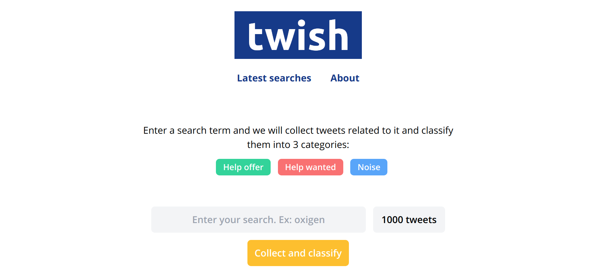

# Twish
*Twish* is a web application that allows you to host tweets classifiers (Machine Learning-based, rule-based, whatever-based). Once you have set up the app, your users can enter a search term and Twish will collect tweets based on it and classify them using the classifiers you set up.

## Features
- Tweets search box (uses Twitter API).
- Classified tweets visualizer.
- Email notifications when classification jobs complete.
- Search history.
- Customizable app name, logo and about page.

## Set up
1. Install [Docker Compose](https://docs.docker.com/compose/install) on your machine.
2. Get the source code on to your machine via git.

`git clone https://github.com/xavierfigueroav/twish && cd twish`

3. Build and run the Docker containers.

`docker-compose up --build`

4. That's it. Open a web browser and hit the URL http://127.0.0.1:3000.
